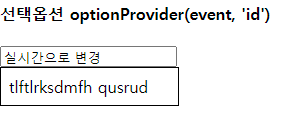
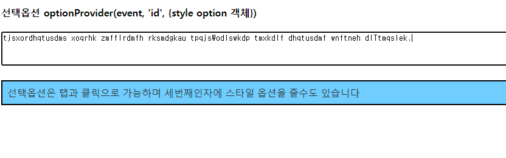

# typingchanger_easy

typingchanger_easy는 한영 키를 잊고 타이핑했을 때 한글을 영어로, 영어를 한글로 자동 변환해주는 모듈입니다. 
2벌식 키보드 배열을 기준으로 작동합니다.

주요 기능
- 한글 ⇄ 영어 변환: 잘못된 키보드 입력을 감지하여 한글을 영어로, 영어를 한글로 자동 변환합니다.
- 실시간으로 한글 ⇄ 영어 변환하고 그에대한 옵션을 제공합니다. 
  <br>*esm에서만 제공합니다*
  <br>(옵션 선택은 click 또는 tab 을 이용하여 선택 가능합니다.)

## 설치 방법

```sh
# with npm
npm i typingchanger_easy

# with yarn
yarn add typingchanger_easy
```

## 사용 방법

commonJS
```js
const { convertKoreanToEnglish, convertEnglishToKorean, convertWithValidation } = require('typingchanger_easy');

// 한글을 영어로 변환
const koreanToEnglish = convertKoreanToEnglish('안녕하세요');
console.log(koreanToEnglish); // 'dkssudgktpdy'

// 영어를 한글로 변환
const englishToKorean = convertEnglishToKorean('dkssudgktpdy');
console.log(englishToKorean); // '안녕하세요'

```

module
```js
import { convertKoreanToEnglish, convertEnglishToKorean, optionProvider } from 'typingchanger_easy';

// 한글을 영어로 변환
const koreanToEnglish = convertKoreanToEnglish('안녕하세요');
console.log(koreanToEnglish); // 'dkssudgktpdy'

// 영어를 한글로 변환
const englishToKorean = convertEnglishToKorean('dkssudgktpdy');
console.log(englishToKorean); // '안녕하세요';

// 추천 제공 기능 예시
document.getElementById('search').addEventListener('input', (event) => {
    optionProvider(event, 'search', {
        fontFamily: 'Arial, sans-serif',
        fontSize: '16px',
        backgroundColor: '#f0f8ff'
    });
});

document.getElementById('search').addEventListener('input', (event) => {
    optionProvider(event, 'searchArea', {
      backgroundColor: '#f0f0f0',
      border: '1px solid #ccc',
      activeItemBackgroundColor: '#ffcc00', // 활성화된 항목의 배경색을 노란색으로 설정
    });
});
```

<h3>convertKoreanToEnglish , convertEnglishToKorean 예제 이미지</h3>


<h3>optionProvider 예제 이미지</h3>


<h3>optionProvider 예제 이미지</h3>



<h2>Methods</h2>

모든 메서드는 독립적으로 사용할 수 있으며, 텍스트 변환 및 추천 기능을 제공합니다.

<table>
  <thead>
    <tr>
      <th>Name</th>
      <th>Params</th>
      <th>Description</th>
    </tr>
  </thead>
  <tbody>
    <tr>
      <td>convertKoreanToEnglish</td>
      <td>text: string</td>
      <td>영문 키보드 설정으로 입력된 한글 텍스트를 올바른 영어로 변환합니다.</td>
    </tr>
    <tr>
      <td>convertEnglishToKorean</td>
      <td>text: string</td>
      <td>한글 키보드 설정으로 입력된 영문 텍스트를 올바른 한글로 변환합니다.</td>
    </tr>
    <tr>
      <td>optionProvider</td>
      <td>event: Event, inputId: string, customStyles?: DropdownStyles</td>
      <td>입력된 텍스트에 따라 추천 목록을 제공하고, 사용자가 선택할 수 있도록 도와줍니다.</td>
    </tr>
  </tbody>
</table>

<h2>Options</h2>
<table>
  <thead>
    <tr>
      <th>Name</th>
      <th>Type</th>
      <th>Default value</th>
      <th>Description</th>
    </tr>
  </thead>
  <tbody>
    <tr>
      <td>customStyles</td>
      <td>DropdownStyles</td>
      <td>기본 스타일</td>
      <td><code>optionProvider</code> 함수에서 추천 목록의 스타일을 사용자 정의할 수 있습니다. 예를 들어 글꼴, 크기, 색상 등을 설정할 수 있습니다.</td>
    </tr>
  </tbody>
</table>

* 커스텀 style은 일반 css 선택자와 동일하나 탭으로 선택한 옵션의 백그라운드 컬러는
  activeItemBackgroundColor로 조작 가능합니다.

라이선스
MIT 라이선스